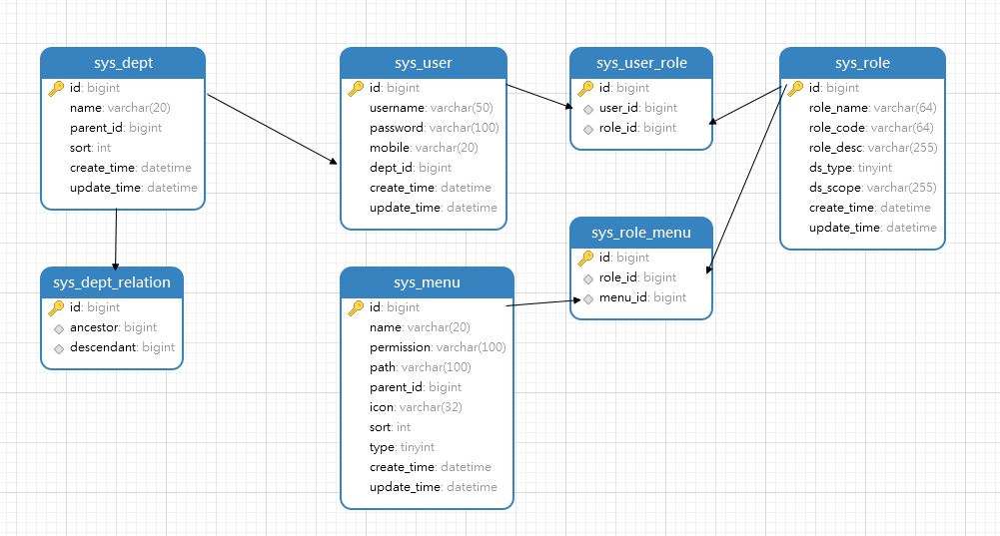

# 权限基本架构

## 介绍
**技术栈：** spring boot + mybatis plus + spring security + mysql + redis

**目的：** 一个有基本功能的脚手架，不包含物业逻辑，不用每次搭项目都重头开始了（偷懒）

## 功能
1. 用户认证登陆
2. 部门管理
3. 菜单管理
4. 角色管理
5. 用户管理
6. 用户按钮权限控制
7. 部门数据权限控制
8. 匿名登陆注解

## 数据库关系


- 用户属于部门下
- 用户有多个角色
- 每个角色对应菜单
- 部门还维护了祖先后代关系

## 功能介绍

### 统一格式返回
```java
    @Override
    public Object beforeBodyWrite(Object o, MethodParameter methodParameter, MediaType mediaType,
        Class<? extends HttpMessageConverter<?>> aClass, ServerHttpRequest serverHttpRequest,
        ServerHttpResponse serverHttpResponse) {

        // o is null -> return response
        if (o == null) {
            return new ResultBean<>();
        }
        // o is instanceof ConmmonResponse -> return o
        if (o instanceof ResultBean) {
            return o;
        }
        // string 特殊处理
        if (o instanceof String) {
            return objectMapper.writeValueAsString(new ResultBean<>(o));
        }
        // 不需要封装，直接原始数据返回
        if (o instanceof ResponseEntity) {
            return o;
        }
        return new ResultBean<>(o);
    }    
```

```json
{
    "code": "标识代码,1表示成功，非1表示出错",
    "data": "返回对象",
    "msg": "异常信息"
}
```

### 登陆
**URL：** localhost:8060/api/user/login

#### 登陆成功

将用户信息和对应的token存至redis

用户信息包含：角色信息，按钮权限信息，部门权限信息

security的所有配置都在 `SpringSecurityConf` 配置类中

```java
    @Override
    public void onAuthenticationSuccess(HttpServletRequest request, HttpServletResponse response,
        Authentication authentication) throws IOException {
        Object principal = authentication.getPrincipal();
        if (principal instanceof AuthUser) {
            AuthUser user = (AuthUser)authentication.getPrincipal();
            String uuid = redisTemplate.opsForValue().get(USER_USERNAME_PRE + user.getUsername());
            if (StringUtils.isEmpty(uuid)) {
                uuid = UUID.fastUUID().toString(true);
            }
            redisTemplate.opsForValue().set(USER_USERNAME_PRE + user.getUsername(), uuid, EXPIRE_TIME_12_HOURS,
                    TimeUnit.SECONDS);
            redisTemplate.opsForValue().set(USER_TOKEN_PRE + uuid, objectMapper.writeValueAsString(user), EXPIRE_TIME_12_HOURS,
                    TimeUnit.SECONDS);

            response.setStatus(200);
            response.setContentType("application/json;charset=UTF-8");
            LoginUserVo loginUserVo = new LoginUserVo();
            loginUserVo.setUserId(user.getUserId());
            loginUserVo.setUsername(user.getUsername());
            loginUserVo.setToken(uuid);
            loginUserVo.setRoles(user.getRoles());
            loginUserVo.setPermissions(AuthorityUtils.authorityListToSet(authentication.getAuthorities()));

            response.getWriter().print(objectMapper.writeValueAsString(new ResultBean<>(loginUserVo)));
            response.flushBuffer();
        }
    }
```

#### 用户认证

将redis中的用户取出存至SecurityContextHolder

```java
    @Override
    protected void doFilterInternal(HttpServletRequest request, HttpServletResponse response, FilterChain chain)
        throws IOException, ServletException {
        // 从请求头中取出token
        String token = request.getHeader("token");
        if (!StringUtils.isEmpty(token)) {
            // 从redis中获取用户名
            String user = redisTemplate.opsForValue().get(USER_TOKEN_PRE + token);
            AuthUser authUser = objectMapper.readValue(user, AuthUser.class);
            if (SecurityContextHolder.getContext().getAuthentication() == null && Objects.nonNull(authUser)) {
                // 解析并设置认证信息（具体实现不清楚）
                UsernamePasswordAuthenticationToken authentication =
                    new UsernamePasswordAuthenticationToken(authUser, null, authUser.getAuthorities());
                authentication.setDetails(new WebAuthenticationDetailsSource().buildDetails(request));
                SecurityContextHolder.getContext().setAuthentication(authentication);

                // 刷新token
                redisTemplate.expire(USER_USERNAME_PRE + authUser.getUsername(), EXPIRE_TIME_12_HOURS,
                    TimeUnit.SECONDS);
                redisTemplate.expire(USER_TOKEN_PRE + token, EXPIRE_TIME_12_HOURS, TimeUnit.SECONDS);
            }
        }
        chain.doFilter(request, response);
    }

```

### 用户按钮权限控制

用户登陆完成后，会得到所有的按钮权限

对接口标识对应的权限，只有匹配才可以访问

```java
    // xxx 在创建菜单按钮时，可以设置
    @PreAuthorize("@pms.hasPermission('xxx')")


    // 匹配用户权限
    public boolean hasPermission(String... permissions) {
		if (ArrayUtil.isEmpty(permissions)) {
			return false;
		}
		Authentication authentication = SecurityContextHolder.getContext().getAuthentication();
		if (authentication == null) {
			return false;
		}
		Collection<? extends GrantedAuthority> authorities = authentication.getAuthorities();
		return authorities.stream().map(GrantedAuthority::getAuthority).filter(StringUtils::hasText)
				.anyMatch(x -> PatternMatchUtils.simpleMatch(permissions, x));
	}

```

### 部门数据权限控制

用户登陆时，会查询所有的部门权限并缓存（0-查看所有，1-自定义，2-本级及以下，3-本级）

用户在执行查询时，会对sql语句进行拦截，最终数据都筛选过滤后的

```java
    @Override
	public void beforeQuery(Executor executor, MappedStatement ms, Object parameter, RowBounds rowBounds,
			ResultHandler resultHandler, BoundSql boundSql) {
		Object parameterObject = boundSql.getParameterObject();

		// 查找参数中包含DataScope类型的参数
		DataScope dataScope = findDataScopeObject(parameterObject);
		if (dataScope == null) {
			return;
		}

		// 获取用户信息
		AuthUser user = SecurityUtil.getUser();

		// 优先获取赋值数据
		if (user.getIsAllDeptScope()) {
			return;
		}

		PluginUtils.MPBoundSql mpBs = PluginUtils.mpBoundSql(boundSql);
		String originalSql = boundSql.getSql();

		String scopeName = dataScope.getScopeName();
		List<Long> deptIds = dataScope.getDeptIds();
		deptIds.addAll(user.getDeptScope());

		if (deptIds.isEmpty()) {
			originalSql = String.format("SELECT %s FROM (%s) temp_data_scope WHERE 1 = 2",
					dataScope.getFunc().getType(), originalSql);
		}
		else {
			String join = CollectionUtil.join(deptIds, ",");
			originalSql = String.format("SELECT %s FROM (%s) temp_data_scope WHERE temp_data_scope.%s IN (%s)",
					dataScope.getFunc().getType(), originalSql, scopeName, join);
		}

		mpBs.sql(originalSql);
	}
```

### 匿名登陆注解

在接口方法上打上`@AnonymousAccess`，则不需要登陆就可以访问

是在加载`security`配置的时候，将需要放行的接口匹配到，并加入配置

```java
    /**
     * 获取标有注解 AnonymousAccess 的访问路径
     */
    private String[] getAnonymousUrls() {
        // 获取所有的 RequestMapping
        Map<RequestMappingInfo, HandlerMethod> handlerMethods = requestMappingHandlerMapping.getHandlerMethods();
        Set<String> allAnonymousAccess = new HashSet<>();
        // 循环 RequestMapping
        for (Map.Entry<RequestMappingInfo, HandlerMethod> infoEntry : handlerMethods.entrySet()) {
            HandlerMethod value = infoEntry.getValue();
            // 获取方法上 AnonymousAccess 类型的注解
            AnonymousAccess methodAnnotation = value.getMethodAnnotation(AnonymousAccess.class);
            // 如果方法上标注了 AnonymousAccess 注解，就获取该方法的访问全路径
            if (methodAnnotation != null) {
                allAnonymousAccess.addAll(infoEntry.getKey().getPatternsCondition().getPatterns());
            }
        }
        return allAnonymousAccess.toArray(new String[0]);
    }
```